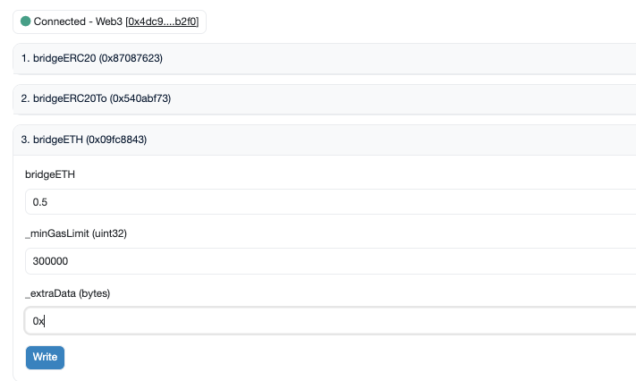

# OFTAdapter POC quickstart

## Step 1 : Initial setup

```
cp .env.example .env
```

Then fill the `PRIVATE_KEY` and `SEPOLIA_RPC_URL` in `.env` with your own values. Also, if you want to do Step 4 (Etherscan verification) which is optional but recommended for easier debugging, get an Etherscan free API key in order to set the value of `ETHERSCAN_API`.

## Step 2 : Funding deployer wallet on both chains

**Important:** Make sure the wallet address corresponding to your `PRIVATE_KEY` if funded on _both_ chains corresponding to this OFT, meaning on both Ethereum Sepolia and Optimism Sepolia. If you already have funds on Ethereum Sepolia, you can bridge part of it to Optimism Sepolia by depositing some funds to the official Optimism smart contract on Ethereum Sepolia:
For bridging some ETH from Sepolia Ethereum to Sepolia Optimism, go to this link https://sepolia.etherscan.io/address/0xfbb0621e0b23b5478b630bd55a5f21f67730b0f1#writeProxyContract and just click on "Connect to Web3" button, then click on the `bridgeETH` tab and fill the 3 fields with correct values (see example on image below): `bridgeETH` should be the amount of ETH you wish to bridge (ensure you have enough funds on Ethereum Sepolia first), `_minGasLimit` should be set to `300000` and you could set `_extraData` as `0x`. Send the transaction by clicking on write and confirm your transaction, then wait approximately for 2 minutes for the bridging flow to process.



**Note:** If you want to add Sepolia Optimism to your (Metamask) wallet just go to this site https://chainlist.org/chain/11155420 and click on `Connect Wallet -> Approve`. This way, you could easily check if your bridging transaction was succesful: after waiting for 1-2 minutes the bridged sent funds should arrive on your wallet on Optimism Sepolia.

## Step 3 : Deploy MyERC20Mock, MyOFTAdapterMock and MyOFTMock

First, deploy the MyERC20Mock token, which is a vanilla ERC20 implementation from OpenZeppelin. Run this command:

```
pnpm i
npx hardhat lz:deploy
```

In the instructions of `lz:deploy`, chose both networks (or chose just ethereum-testnet, since optimism-testnet will be filtered out in the deployment script of the ERC20). Then enter `MyERC20Mock` when asked for the deploy script tag. The ERC20 token will be deployed on Ethereum testnet and 100 tokens will be minted initially for the deployer.

Please carefully note the MyERC20Mock contract address which has been logged during the run of the previous script. In your `hardhat.config.ts` file, add the following configuration to the `ethereum-testnet` you want to deploy the OFTAdapter to:

```typescript
oftAdapter: {
    tokenAddress: '0x0', // Replace `0x0` with the address of the ERC20 token you want to adapt to the OFT functionality.
}
```

After updating your hardhat.config.ts file accordingly, second step is to deploy the OFTAdapter to the Ethereum testnet by running again:

```
npx hardhat lz:deploy
```

You can still select either both networks or alternatively uniquely the `ethereum-testnet` network (Optimism network will be filtered out because its config does not contain and `oftAdapter` field). But this time, enter `MyOFTAdapterMock` when asked for the deploy script tag. This will deploy the OFTAdapter contract on Ethereum Sepolia testnet.

Finally, third deployment step is to deploy the `MyOFTMock` contract on the Optimism Sepolia testnet. Again, you should run:

```
npx hardhat lz:deploy
```

You can still select either both networks or alternatively uniquely the `optimism-testnet` network this time. Now enter `MyOFTMock` when requested for the deploy script tag. This will deploy the `MyOFTMock` contract on Optimism Sepolia testnet.

## Step 4 : Etherscan verification (Optional)

In order verify the two contracts (`MyERC20Mock` and `MyOFTAdapterMock`) on Etherscan for the Ethereum Sepolia network, use this command (don't worry if the following scripts return you an error or an invalid explorer URL link - see the note at the end of this step):

```
pnpm verify:etherscan:ethereum:sepolia
```

And to verify the `MyOFTMock` contract deployed on the Optimism Sepolia network run:

```
pnpm verify:etherscan:optimism:sepolia
```

**Note:** Due to a bug in the `verify-contract` task, sometimes those scripts will log an error and/or return a wrong URL for block explorer link, but most of the times, despite those errors, if you check the actual results by searching for corresponding contracts addresses on the block explorer, you will notice that the contracts will actually be succesfully verified after running those commands (i.e [https://sepolia.etherscan.io/](https://sepolia.etherscan.io/) for Ethereum testnet and [https://sepolia-optimism.etherscan.io/](https://sepolia-optimism.etherscan.io/) for Optimism testnet).

## Step 5 : Wire contracts

```
npx hardhat lz:oapp:wire --oapp-config layerzero.config.ts
```

And follow straightforward instructions to wire the `MyOFTAdapterMock` contract on Ethereum testnet with the `MyOFTMock` on Optimism testnet.

## Step 6 : Cross-chain transfer

For example you can send `1.5` MyERC20Mock token from the deployer wallet to a custom receiver address by running this command and following instructions:

```
npx hardhat lz:oft:send --src-eid 40161 --dst-eid 40232 --amount 1.5 --to [RECEIVER ADDRESS]
```

**Note** In the OFTAdapter case here, contrarily to the OFT case, 2 transactions are sent in previous script instead of 1, because the sender must first approve the corresponding amount of the ERC20 token to the OFTAdapter (i.e calling approve method on the ERC20 method and passing the OFTAdapter address and correct amount as parameters), before locking them to the OFTAdapter contract in a second `send` transaction on OFTAdapter (reminder: in the OFT case, initiating a token transfer happens by directly burning an amount of the OFT contract by calling the `send` method of the OFT contract).

Once these transactions are sent, wait around 2 minutes and check the receiver's account on Etherscan Optimism Sepolia explorer that the receiver indeed received `1.5` MyOFTMock on Optimism testnet by clicking on `Token Holdings` there.

You could then also send back the tokens from Optimism Sepolia testnet to Ethereum Sepolia chain, by swapping the values of `--src-eid` and `--dst-eid` flags from previous command.
